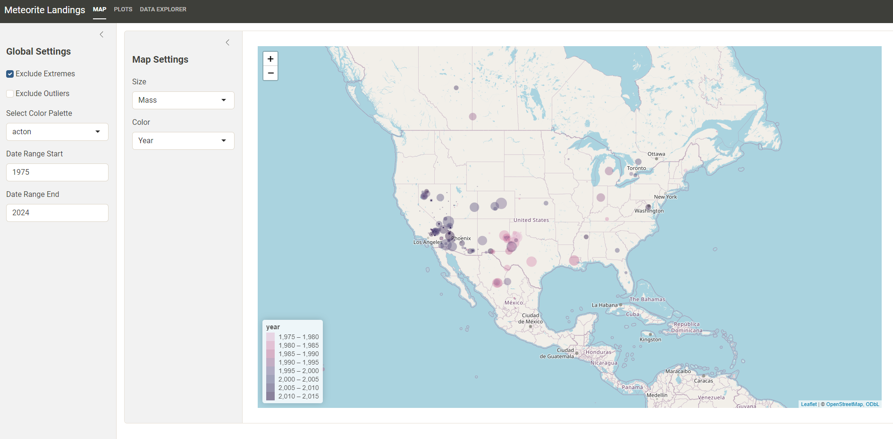
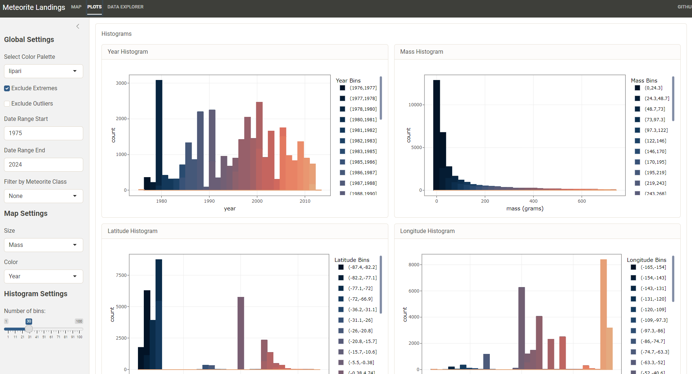

# Meteorite Landings App

## Description

Using data taken from [Data.gov](https://catalog.data.gov/dataset/meteorite-landings) I'll be making an interactive app using R Shiny that shows meteorite landing data. It features a map using Leaflet, a couple of histogram, and a data viewer.

It adds circles to the map with user input variables for radius and color, with variable options including mass and year.

It has two date inputs with minimum and maximum corresponding to the min and max values of meteorite landing years, and it has inputs for excluding extreme and outliers from the data.

When you click on a circle on the map with leaflet, a value card pops up showing you the name, class, mass, year found and exact coordinates.

## Links
| Shinyapps.io | Github|
|---|---|
| [Shinyapps](https://zachpeagler.shinyapps.io/01_meteorites) | [Github](https://github.com/zachpeagler/App-A-Day/tree/main/01_meteorites)|
|||

## Screenshots

#### Map Panel

#### Popup

#### Plot Panel
