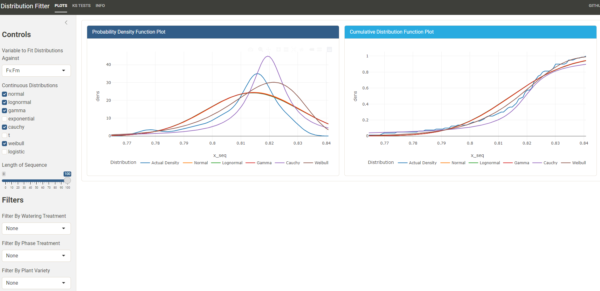

# Distribution Fitter

## Description
I wanted to make a useful function that will help me in all my analyses down the line, a distribution fitting function!. No doubt these already exist, but making one specific to my needs is a great exercise and who knows, maybe it'll actually be good and I can release it as a package on CRAN or something.

**Update 10/16/2024:** I'm making this project into a package! RdistUtils, a collection of utility functions for fitting distributions in R. Check it out on [Github here.](https://github.com/zachpeagler/RdistUtils)

This distribution fitter is for **continuous** distributions only. I'll add discrete distributions later as a separate function.

## Links

| Shinyapps.io | Github|
|---|---|
| [Shinyapps](https://zachpeagler.shinyapps.io/02_distribution_fitter/) | [Github](https://github.com/zachpeagler/App-A-Day/tree/main/02_distribution_fitter)|
|||

## Screenshots
#### Distribution Plots

## Functions

All the functions used here are documented in the file [distribution_fitting](/docs/distribution_fitting.Rmd), an Rmarkdown file detailing each function's description, usage, arguments, and details.

## Data

### Example Data

This's example data is pulled from [Data.gov](https://catalog.data.gov/dataset/data-from-plant-strategies-for-maximizing-growth-during-drought-and-drought-recovery-in-so-98fae) from a paper titled "Plant strategies for maximizing growth during drought and drought recovery in Solanum melongena L. (eggplant)" and features data from a study about eggplant drought recovery that has several continuous biological response variables that can be used for fitting continuous distributions.

### Plant strategies for maximizing growth during drought and drought recovery in Solanum melongena L. (eggplant) abstract
> This data represents the collection of physiological and biometric data of above- and below-ground plant traits in four species of Solanum melongena of Philippine origin (PHL 4841, PHL 2778, PHL 2789, and Mara). Half of the plants were subjected to significant water deficit, and half again of those deficit plants were allowed to recover after subsequent watering. This data is suitable to serve as a benchmark for trait values in S. melongena, as well as in studies of trait responses to terminal drought and episodic drought in agricultural settings. Traits in this dataset include Leaf Water Potential, total leaf area (cm2), Leaf Canopy temp, Fv/Fm, Photosynthesis, Stomatal Conductance, Transpiration Rate, Water Use Efficiency, Green Leaf Dry Weight, Senesced Leaf Dry Weight, Stem Dry Weight, Total Shoot Dry Weight, Leaf Area Ratio, Specific Leaf Area, Specific Leaf Weight, Basal Fine Root Mass, Total Fine Root Mass, Coarse Roots Mass, Total Root Mass, Root:Shoot Ratio, Total Fine Root length (cm), Total Fine Root Surface Area (m2), Total Fine Root Volume (m3), Specific fine root length (m/g), Root tissue density (g/m3), Fine root length:Leaf area Ratio (cm/çm2), and root mass fraction. Methods and materials: A greenhouse experiment was set up to identify physiological traits associated with drought tolerance in eggplant. Solanum melongena genotypes PHL 4841, PHL 2778 and PHL 2789 were chosen based on drought performance in previous field and greenhouse trials (58) of 100 germplasm accessions from the National Plant Genetic Resources Laboratory in the Institute of Plant Breeding, University of the Philippines at Los Baños, Laguna, Philippines. S. melongena ‘Mara’, a released variety from the Institute of Plant Breeding, UP Los Baños was included as a reference variety. Seeds were sown into seedling trays containing fritted clay (Turface Greens Grade, Profile Products, Buffalo Grove, IL, USA) at the end of February in a greenhouse in Fort Collins, CO. After 17-21 days seedlings were transplanted into 7.57 L plastic pots containing 10 kg fritted clay and watered to holding capacity via a drip irrigation before treatments were established. Pots were positioned on two greenhouse benches in a randomized complete block design of two factors: water availability (drought vs. well-watered control) and genotype (four genotypes). There were 5 replicates of each block (40 plants). This basic block design was doubled, and plants were harvested at 2 time points (post-drought and post-recovery) for a total of 80 plants. Plants were maintained under a combination of natural sunlight and supplemental LED illumination on a 14:10 hour day:night cycle, corresponding to average temperatures of 22 and 29˚C. Plants were fertigated using Grow More water soluble fertilizer (Grow More, Inc., Gardena, CA) amended with additional N in the form of urea and additional K in the form of KH2PO4 to achieve 79.5-22.5-5 ppm N:P:K daily for the first month after transplantation and transitioned to 60-30-120 ppm N:P:K for the remainder of the experiment. Drought treatments began at 5 weeks after transplanting and lasted for 2 weeks for all blocks (80 plants). “Drought” plants received 30% of evapotranspiration (ET) of “control” plants daily for the first week, and 10% daily in the second week. “Control” plants were given 100% of ET daily. ET was calculated by weighing control pots daily at 1400 hr to measure evaporative and transpiration water loss relative to 100% holding capacity. After the conclusion of the drought treatment, all remaining plants were re-watered to pot holding capacity. Physiological measurements Randomized measurements of drought and control plants were carried out from the 11th through the 15th and final day of the drought treatment on 50% of the experimental plant population. On each day, the third fully expanded leaf of each plant was measured for chlorophyll fluorescence (Fv/Fm) from 07:30 until 08:30 using a portable OS5P fluorometer (Opti-Sciences Inc., NH, USA). Each leaf was dark acclimated with leaf clips for 20 minutes prior to measurement. From 09:00 to 12:00 hrs, the same leaves were measured for photosynthetic rate, stomatal conductance, and transpiration using the Li-COR 6400XT infrared gas analyzer with attached leaf measurement chamber (LiCOR Inc., Lincoln, Nebraska). Conditions in the leaf measurement chamber were the following: PAR (photosynthetically active radiation) of 1800 µmol m-2s-1, leaf temperature of 25˚C, and CO2 concentration of 400 µmol mol-1. Instantaneous water use efficiency (WUEi) was calculated as the ratio of photosynthesis (An) to stomatal conductance (gs). Leaf water potential (ΨL) was determined with use of a Scholander pressure chamber (Soil Moisture Equipment Corp., Santa Barbara, CA, USA). The same leaf used for gas exchange measurements was cut from each plant and immediately placed in a plastic bag in a cooler until ΨL could be measured (up to 1 hour). After one week under full watering, “recovered” and control plants were again measured as above for chlorophyll fluorescence and leaf water potential. Plant growth measurements Following physiological measurements, the aboveground portions of drought and control plants were cut and partitioned into leaves and stem. Total leaf area was measured for each plant using a Li-3100C leaf area meter (LiCOR Inc., USA). Partitioned shoot tissue was then oven dried at 60˚C for 48 hours and weighed. The belowground biomass of each plant was washed free of fritted clay and partitioned into fine and coarse roots. A representative sample of fine roots was obtained for each sample and stored in 30% ethyl alcohol for root scanning. Preserved fine roots were scanned in water in 2-D transparency mode with a desktop scanner (EpsonV750, Epson America Inc., USA) and analyzed using WinRHIZOTM software (Regent Instruments Inc., Canada). Remaining fine and coarse roots were dried and weighed as above. Leaf area ratio (total leaf area per total plant dry mass, m2 g-1; LAR) and specific leaf area (leaf area per leaf dry mass, m2 g-1; SLA), and leaf mass area (leaf dry mass per leaf area, g m-2; LMA) were calculated using the leaf data for each plant. Specific root length of fine roots (root length per dry mass, m g-1; SRLFineRts) and total root mass fraction (RMF, total root mass per total plant weight) were calculated using the fine root length and root biomass data from each plant (31,59) At the end of the recovery phase, all plants were also destructively sampled for measurement of leaf area and above- and below-ground biomass partitioning as above. Resources in this dataset:Resource Title: Data from: "Plant strategies for maximizing growth during drought and drought recovery in Solanum melongena L. (eggplant)". File Name: full_dataset.csv
