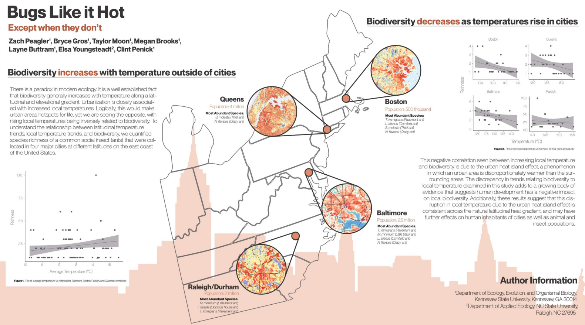
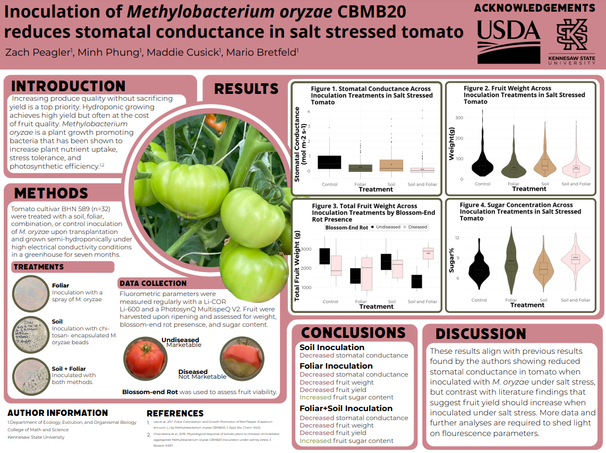

# Posters

## Bugs Like it Hot

My first proper research presentation, made in 2021 during my Bachelor's Degree of Science in Biology at Kennesaw State University.

This poster was the result of my time in the Penick Lab, working under the incredible Clint Penick looking at ant biodiversity in urban areas along a latitudinal gradient on the US east coast.

## Tomato Inoculants 2023

The first poster of my Master's of Science in Integrative Biology from Kennesaw State University.

During my graduate degree I did research under the amazing Mario Bretfeld examining the effects of inoculation and salt stress on tomatoes.

